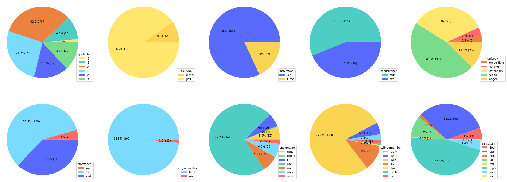
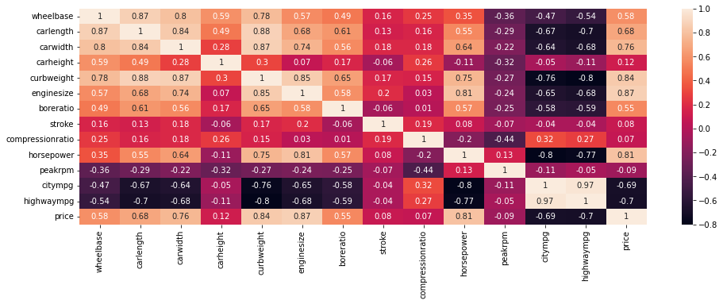
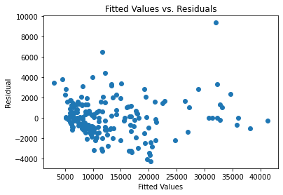
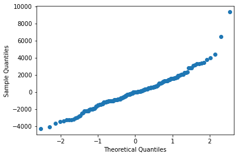
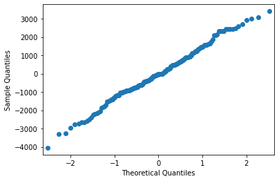
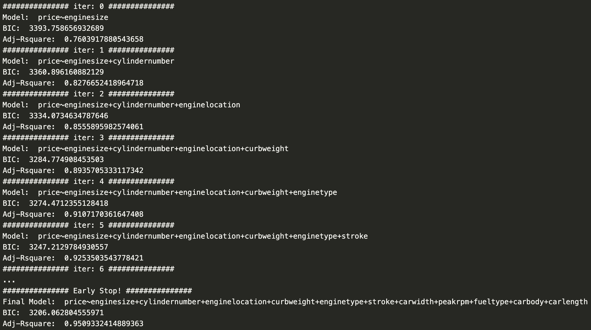

# Car Price Prediction:
The project covers the following:
1. exploratory data analysis
2. regression model
3. ANOVA Analysis
4. Model Diagnosis
    - Check Constant Variance
    - Check Influence Point (Delete Influence Point)
    - Check Nomality
    - Check Variance Inflation Factor
5. Model Selection (Step BIC)
## Dataset: 
https://www.kaggle.com/datasets/hellbuoy/car-price-prediction  

## EDA (Exploratory Data Analysis):
- Percentage distribution in each predictor:

- Correlation Matrix:


## Regression Model:
``` python
model = smf.ols("price~symboling+fueltype+aspiration+doornumber+carbody+drivewheel+enginelocation+wheelbase+carlength+carwidth+carheight+curbweight+enginetype+cylindernumber+enginesize+fuelsystem+boreratio+stroke+compressionratio+horsepower+peakrpm+citympg+highwaympg", data=train_data).fit()
```

## ANOVA Analysis:
- `ANOVA Typ1` table shows additional significant predictors: **[aspiration, carlength, doornumber, drivewheel, fuelsystem, horsepower, symboling, wheelbase]**,  
- `ANOVA Typ3` will have the same result as `ANOVA Typ2`
Both table show that **[carbody, carwidth, curbweight, cylindernumber, enginelocation, enginesize, enginetype, fueltype, peakrpm, stroke]** are the significant predictors of the fitted model.  

## Model Diagnosis:
### 1. Check Constant Variance  
  
Model: $e^2_i = \gamma_0 + \gamma_1 x_{i,1} + ... + \gamma_{p-1} x_{i, p-1} + \xi_i$  
$H_0: \gamma_1+\gamma_2+\gamma_3+...+\gamma_{p-1}=0$  
$H_1:$ at least one $\gamma_k \neq 0$  
$p\_value=0.02646033548618978$  
As $p\_value \lt \alpha$, indicates **significant heteroscendasticity problem**  
### 2. Check Influence Point & Check Nomality
- With Influence Point:  

  
- Delete Influence Point and Fit the Model Again:  
  

### 3. Check Variance Inflation Factor:
Summary for VIF process, the predictors without violating the multicollinearity issue:  
['aspiration',
 'doornumber',
 'drivewheel',
 'enginelocation',
 'wheelbase',
 'carlength',
 'carwidth',
 'carheight',
 'enginesize',
 'boreratio',
 'stroke',
 'compressionratio',
 'horsepower',
 'peakrpm',
 'highwaympg']

### 4. Model Selection (Step BIC)
 
## Summary:
After removing the influence point, we fix the `normality` issue and keep the model away from `heteroscedasticity`.  
We use `Step-BIC` to find the best model using the updated dataset.  
Final Selected Model:  
`price ~ enginesize + cylindernumber + enginetype + horsepower + carwidth + stroke + compressionratio + enginelocation + curbweight + peakrpm + carlength + doornumber`